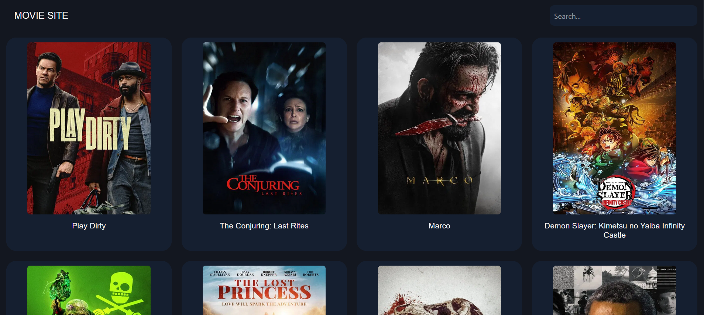
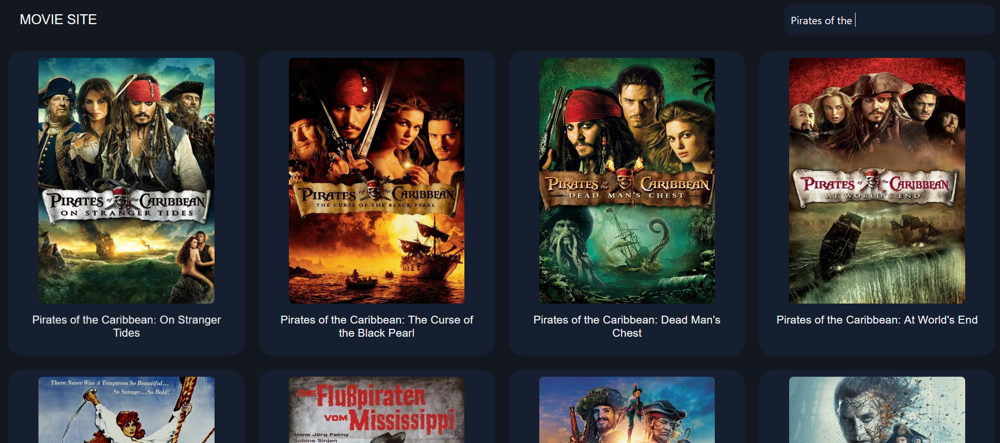

### 🎥Movie APP
Simple JavaScript App to fetch some results from TMDB (The Movie DataBase) API.
On page load it fetches the most popular movies currently on the db and the user can search for a specific movie with the search bar.

You will need YOUR OWN API key, which you can get for free by registering on the TMBD website and requesting it.

## 📸 Screenshots
| **App View** |
|----------------|
| |
| **Search For Movies** |
|  | 

## ✨ Features

- **Automatic Display Of Popular Movies On Load**:
  - When loading the page it will fetch the most popular movies in the db at the moment.
  - These results will be dispalyed on cards that show the movie's poster.
- **Search Functionality**:
  - Users can search the db for movies by writing in the search bar and pressing ENTER.

## 🛠️ Technologies Used

- **JavaScript**: Core logic for sorting algorithms and animations.
- **HTML/CSS**: Styling for the minimalistic UI and bar visualizations.
- **Node.js/NPM**: For project setup and dependency management.
- **VSCode Live Server Extension**: To run the app locally.

## 📋 Prerequisites

To run Movie App, ensure you have:
- Node.js (v16 or higher) and NPM installed.
- A modern web browser (e.g., Chrome, Firefox).
- Git (optional, for cloning the repository).
- A web server to run the app (e.g. VSCode has extensions for Live Servers)
